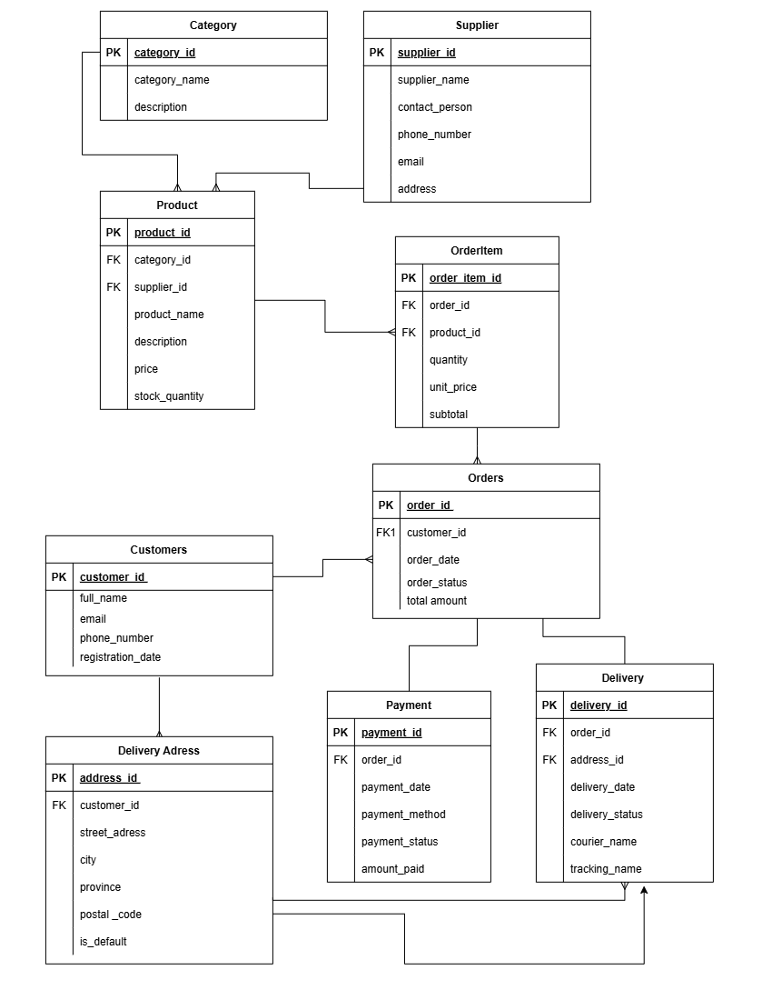

# WitleShop Database Design

Database design for WitleShop online store.

## Entities I identified

1. Customer
2. DeliveryAddress
3. Category
4. Supplier
5. Product
6. Order
7. OrderItem
8. Payment
9. Delivery

## Primary Keys

- Customer - CustomerID
- DeliveryAddress - AddressID
- Category - CategoryID
- Supplier - SupplierID
- Product - ProductID
- Order - OrderID
- OrderItem - OrderItemID
- Payment - PaymentID
- Delivery - DeliveryID

## Foreign Keys

- DeliveryAddress.CustomerID links to Customer
- Order.CustomerID links to Customer
- Product.CategoryID links to Category
- Product.SupplierID links to Supplier
- OrderItem.OrderID links to Order
- OrderItem.ProductID links to Product
- Payment.OrderID links to Order
- Delivery.OrderID links to Order
- Delivery.AddressID links to DeliveryAddress

## Relationships

- Customer to DeliveryAddress = 1:M (one customer, many addresses)
- Customer to Order = 1:M (one customer, many orders)
- Order to Payment = 1:1 (one order, one payment)
- Order to Delivery = 1:1 (one order, one delivery)
- Order to Product = M:N (resolved with OrderItem table)
- Category to Product = 1:M (one category, many products)
- Supplier to Product = 1:M (one supplier, many products)

Product ---< Supplier

Key:
---< means one to many
---- means one to one
< > means many to many
